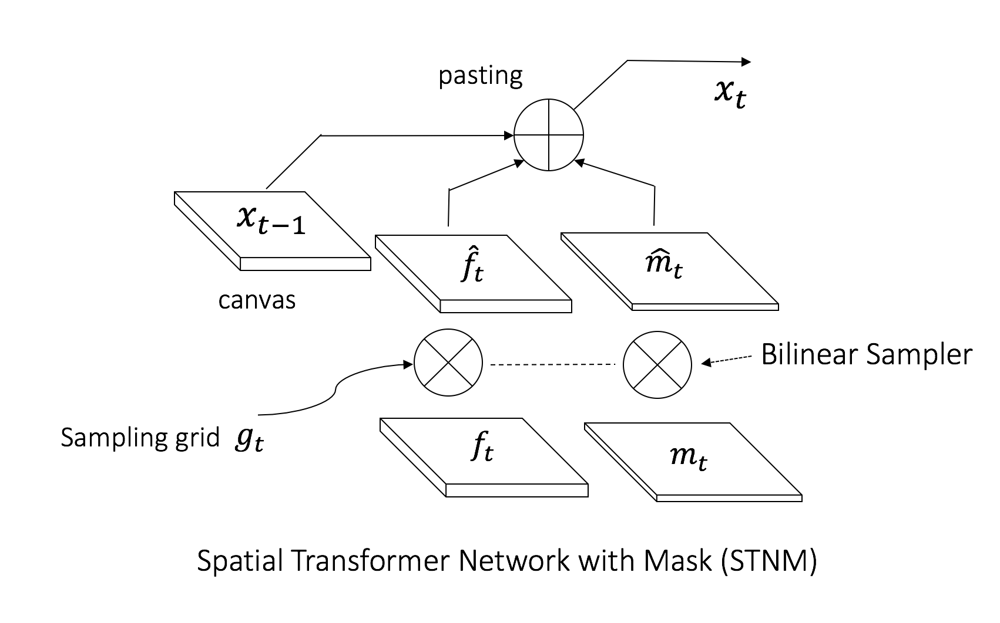

# Pytorch spatial transformer network with mask (STNM)

STNM was used in our ICLR 2017 paper "LR-GAN: Layered Recursive Generative Adversarial Networks for Image Generation".

### Introduction

Given the canvas, foreground image, foreground mask and the (affine) transformation matrix, STNM pastes the transformed foreground to the canvas via alpha blending guided by the transformed foreground mask. The formulation is:

<div style="color:#0000FF" align="center">

</div>

<div style="color:#0000FF" align="center">

</div>

As we can see, STNM involves a down sampling process, which transform the foregound image and foregorund mask into a smaller region. However, I found directly using a upsampler works good or even better than downsampler in my experiments. As such, I used the original biliear sampler in STN. The core code for STNM is in the [stnm_cuda_kernel.cu](https://github.com/jwyang/stnm.pytorch/blob/master/script/src/stnm_cuda_kernel.cu).

### Build

1. Install *cffi* with pip.

2. Install [PyTorch](http://pytorch.org/) with proper commands.

3. Go to the folder *script*, and them simply run the following commands:
```bash
$ ./make.sh
$ python test.py
```
If there is no errors by far, then congratulations, you make it!

### Citation
If you find our code is useful in your researches, please cite:

    @article{yang2017lr,
        title={LR-GAN: Layered recursive generative adversarial networks for image generation},
        author={Yang, Jianwei and Kannan, Anitha and Batra, Dhruv and Parikh, Devi},
        journal={ICLR},
        year={2017}
    }

and

    @inproceedings{jaderberg2015spatial,
        title={Spatial transformer networks},
        author={Jaderberg, Max and Simonyan, Karen and Zisserman, Andrew and others},
        booktitle={Advances in Neural Information Processing Systems},
        pages={2017--2025},
        year={2015}
    }

### Reference & Acknowledgement

This project is built based on [pytorch-stn](https://github.com/fxia22/stn.pytorch). Thanks to the author for such nice work.
