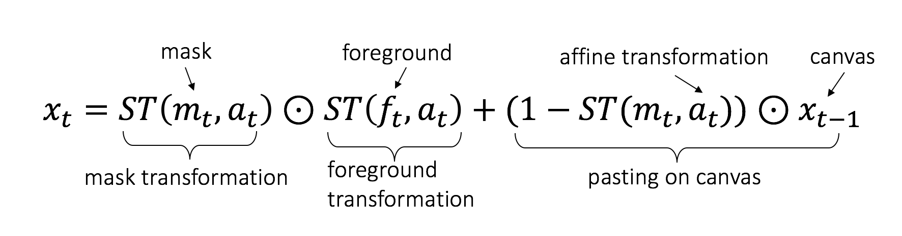

# Pytorch spatial transformer network with mask (STNM)

STNM was used in our ICLR 2017 paper "LR-GAN: Layered Recursive Generative Adversarial Networks for Image Generation".

### Introduction

Given the canvas $$x_{t-1}$$, foreground image $f_t$, foreground mask $m_t$ and the (affine) transformation matrix $a_t$, STNM pastes the transformed foreground to the canvas via alpha blending guided by the transformed foreground mask. The formulation is:

<div style="color:#0000FF" align="center">

</div>

### Build

1. Install *cffi* with pip.

2. Install [PyTorch](http://pytorch.org/) with proper commands.

3. Go to the folder *script*, and them simply run the following commands:
```bash
$ ./make.sh
$ python test.py
```
If there is no errors by far, then congratulations, you make it!

### Citation
If you find our code is useful in your researches, please cite:

    @article{yang2017lr,
        title={LR-GAN: Layered recursive generative adversarial networks for image generation},
        author={Yang, Jianwei and Kannan, Anitha and Batra, Dhruv and Parikh, Devi},
        journal={ICLR},
        year={2017}
    }

and

    @inproceedings{jaderberg2015spatial,
        title={Spatial transformer networks},
        author={Jaderberg, Max and Simonyan, Karen and Zisserman, Andrew and others},
        booktitle={Advances in Neural Information Processing Systems},
        pages={2017--2025},
        year={2015}
    }

### Reference & Acknowledgement

This project is built based on [pytorch-stn](https://github.com/fxia22/stn.pytorch). Thanks to the author for such nice work.
